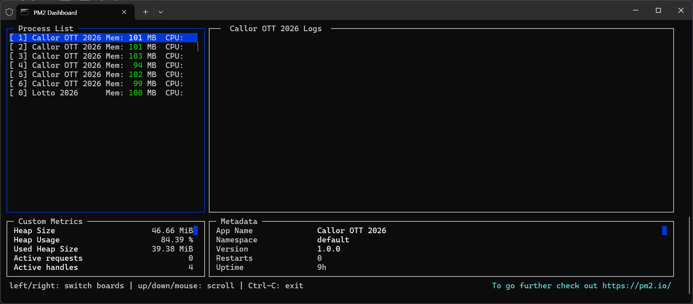

# pm2 실시간 모니터링

- 리눅스의 top 명령어처럼 실시간으로 모든 프로세스의 CPU, 메모리 사용량, 그리고 로그까지 한눈에 모니터링할 수 있는 PM2 명령어

```shell
pm2 monit
```



## pm2 monit 화면 구성 및 주요 기능

명령어를 실행하면 대시보드 형태의 화려한 실시간 화면이 나타난다.

- 왼쪽 상단 (App List): 현재 실행 중인 프로세스 목록과 각각의 실시간 CPU 및 메모리 점유율이 top처럼 계속 업데이트 된다.
- 오른쪽 상단 (App Information): 선택한 프로세스의 상세 정보(포트, 실행 경로, 재시작 횟수 등)를 보여준다.
- 하단 (Logs): 선택한 프로세스에서 출력되는 콘솔 로그(console.log)와 에러 로그가 실시간으로 흘러간다.

## 자주 쓰는 단축키

- 방향키 (↑ / ↓): 모니터링할 프로세스를 전환.
- Ctrl + C: 모니터링 화면을 종료하하기.
